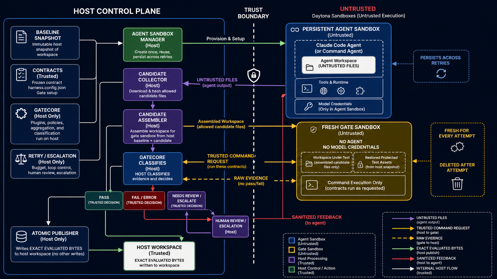
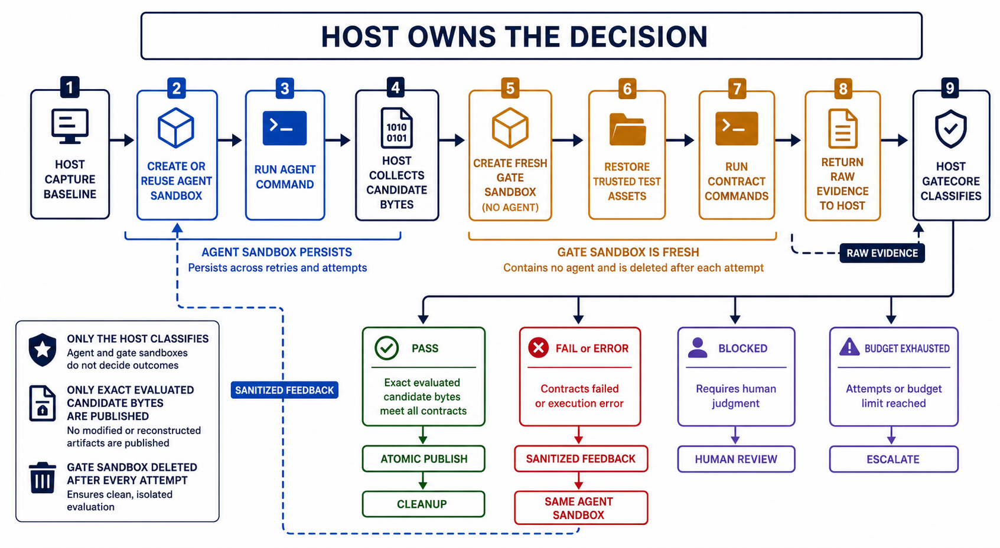

# Harness Daytona 沙箱门禁架构

> 状态：当前实现
>
> 更新日期：2026-06-17
>
> 适用范围：`harness run --driver claude` 与
> `harness run --driver command`

## 1. 架构目标

Harness 将“执行任务”和“决定是否通过”拆成两个不同权限域：

- agent 在持久化 Daytona 沙箱中修改候选文件；
- 每轮远端门禁在全新的 Daytona 沙箱中执行；
- 需要宿主能力的门禁，例如连接本机微信开发者工具的小程序契约，在宿主临时候选工作区执行；
- 合约、判定、重试、升级和发布始终由宿主进程控制；
- agent 和 gate 沙箱都不能直接产生可信的 `pass`；
- 只有经过门禁验证的精确候选字节可以写回宿主工作区。

核心安全不变量是：

> 沙箱只产生文件和原始执行证据，宿主才拥有决策权。

## 2. 总体架构



图中的关键边界：

- **宿主控制面**是可信域，持有 baseline、合约、`GateCore`、verdict、
  循环预算和 publisher。
- **agent 沙箱**是不可信执行域，允许 Claude Code 或自定义命令修改候选文件。
- **gate 沙箱**是不可信证据采集域，不包含 agent，也不接收模型凭证。
- gate 沙箱只返回退出码、stdout、stderr、耗时或 HTTP 响应等原始证据。
- **host-local gate** 是宿主控制的临时工作区，用于必须访问本机资源的契约。
  当前用于 `type: miniprogram` 连接本机微信开发者工具。
- `GateCore` 在宿主侧把原始证据分类为
  `pass`、`fail`、`error` 或 `needs_review`。

## 3. 组件职责

| 组件 | 所在位置 | 职责 | 信任级别 |
|---|---|---|---|
| CLI 装配 | `src/cli.ts` | 加载配置、合约、插件和 Daytona 环境 | 可信 |
| 循环控制器 | `src/harness/run.ts` | 控制 attempt、反馈、预算、升级和发布 | 可信 |
| Baseline Snapshot | `src/harness/sandbox/workspace.ts` | 从宿主 Git 工作区捕获精确文件字节和元数据 | 可信 |
| Sandbox Policy | `src/harness/sandbox/policy.ts` | 限制候选根、保护路径、文件类型和容量 | 可信 |
| Daytona Adapter | `src/harness/sandbox/daytona.ts` | 创建沙箱、上传下载、PTY、命令执行和清理 | 边界适配 |
| Run Environment | `src/harness/sandbox/environment.ts` | 管理持久 agent 和每轮全新 gate 沙箱 | 可信编排 |
| Candidate Collector | `src/harness/sandbox/workspace.ts` | 下载、校验并生成宿主持有的候选快照 | 可信 |
| Host-local Gate | `src/harness/host-gate.ts` | 将候选快照 materialize 到宿主临时目录并运行 host-only 合约 | 可信 |
| Execution Target | `src/harness/execution.ts` | 定义命令和 HTTP 原始证据协议 | 可信协议 |
| GateCore 与插件 | `src/gate.ts`、`src/plugins/*` | 在宿主侧验证证据并聚合结果 | 可信 |
| Publisher | `src/harness/sandbox/publish.ts` | 原子写入门禁实际验证过的精确字节 | 可信 |
| Agent Sandbox | Daytona | 执行 agent 并修改候选工作区 | 不可信 |
| Gate Sandbox | Daytona | 运行合约命令并返回原始证据 | 不可信 |

## 4. 完整执行流程



1. 宿主校验 Daytona、模型环境变量和 sandbox policy。
2. Claude run 先生成 `runId` 并写入 `.harness/runs/<runId>.json`。
3. Claude run 要求宿主显式选择 Agent Snapshot。
4. 宿主加载并验证冻结合约，捕获当前 Git 工作区 baseline。
5. Harness 从选定 Snapshot 创建一个 agent 沙箱并上传 agent 可见文件。
   对 Claude run，agent 沙箱额外挂载 Daytona volume
   `harness-claude-observability`：`runs/<runId>` 挂到
   `/harness-observability`。
6. 宿主执行 Node/npm/npx/Claude preflight 和 agent setup。
7. Claude Code 或 command agent 在该沙箱中执行任务。Claude run 在命令启动前
   不设置 `CLAUDE_CONFIG_DIR`，让 Claude Code 使用默认
   `/home/daytona/.claude` 写入原生 `.claude` 状态文件。
   首轮 Claude attempt 从 stream-json 捕获 session id；后续 gate-fail retry
   在同一个 agent 沙箱中执行 `claude --resume <sessionId>`。
   每次 attempt 的原始 stream-json stdout 由远端 Claude 命令直接写入
   `/harness-observability/attempt-<n>/claude-stream.jsonl`；命令结束后 Harness
   把 sandbox-local `/home/daytona/.claude` 复制到
   `/harness-observability/.claude`。
8. 宿主通过 Daytona 文件 API 收集候选文件，不信任沙箱内的 Git。
9. 宿主严格校验路径、文件类型、大小、哈希和保护路径。
10. Harness 按执行域拆分契约：`miniprogram` 走 host-local，其它机器门禁走远端
    gate 沙箱。
11. 如果存在远端契约，Harness 为当前 attempt 创建一个全新的 gate 沙箱。
12. 宿主在 gate 沙箱中组装 baseline、候选文件和受保护测试资产。
13. gate 沙箱在候选文件和受保护资产都组装完成后执行 `gateSetup`。
14. 若远端契约不需要 loopback HTTP，gate 沙箱关闭出站网络并执行宿主发出的合约命令。
    若契约访问 `localhost`、`127.0.0.1` 或 `::1`，当前 Daytona
    `networkBlockAll` 会同时阻断 loopback，因此本轮保持网络开启并在 observation 中记录
    `reason=loopback-http`。
15. gate 沙箱把原始证据返回宿主，随后被删除。
16. 如果存在 host-local 契约，宿主将同一份 `CandidateSnapshot` materialize 到
    临时目录，恢复受保护文件，运行 `GateCore` 的 host-local 合约，然后删除临时目录。
17. 宿主聚合远端 gate 和 host-local gate 的所有结果。
18. `fail` 或 `error` 生成受限诊断，反馈给原 agent 沙箱继续下一轮。
19. `blocked` 停止自动循环，等待人工 verdict。
20. 超出轮数、时间、token 或重复失败阈值时升级。
21. `pass` 时 publisher 写回门禁验证过的精确候选快照。
22. run manifest 持续记录 host 事件、agent/gate sandbox id、attempt 结果和
    错误原因；`.claude` artifact 留在 Daytona volume 中。

agent 沙箱跨重试保留上下文。Claude resume 必须复用首轮捕获的 session id；
缺失 session id、resume 后产生不一致 session，或无法确认复用时，Harness
fail closed，不启动新的对话。gate 沙箱每轮重新创建，避免继承 agent 控制的
进程、缓存、凭证或隐藏状态。

## 5. 数据所有权

| 数据 | 产生者 | 使用者 | 是否可信 |
|---|---|---|---|
| Baseline 文件与哈希 | 宿主 | collector、gate assembler、publisher | 是 |
| 合约和冻结哈希 | 宿主 | `GateCore` | 是 |
| 模型凭证 | 宿主进程环境 | 仅 agent PTY | 对 gate 不可见 |
| Agent Snapshot | 宿主进程环境 | 仅 agent sandbox 创建请求 | 对 gate 不可见 |
| Agent stdout、Git、patch 声明 | agent 沙箱 | 仅用于诊断 | 否 |
| Candidate 文件 | agent 沙箱 | 宿主 collector | 收集前否 |
| CandidateSnapshot | 宿主 collector | gate assembler、publisher | 是 |
| 命令退出码与输出 | gate 沙箱 | 宿主插件 | 原始证据 |
| 小程序 runner 退出码与输出 | 宿主临时候选工作区 | 宿主插件 | 原始证据 |
| `CheckResult`、`GateReport` | 宿主 | run loop | 是 |
| verdict、retry、escalation | 宿主或人工 | run loop | 是 |
| `.harness/runs/<runId>.json` | 宿主 | 运维排障、最近运行状态 | 是 |
| `.claude` artifact | Claude Code agent 沙箱 | 运维排障 | 否，作为原始 agent 记录处理 |

## 6. 门禁不可干预保证

### 6.1 Agent 看不到裁决资产

agent 沙箱不接收：

- contracts；
- verdicts；
- `.harness` 状态；
- gate 选择逻辑；
- 受保护测试；
- CI 配置；
- Harness gate runtime。

### 6.2 Gate 沙箱没有 Agent

gate 沙箱：

- 每轮重新创建；
- 不安装或启动 Claude Code；
- 不接收 Agent Snapshot；
- 不接收 Anthropic 环境变量；
- 不接收 Daytona observability volume；
- 不复用 agent 沙箱文件系统；
- 对不依赖 loopback HTTP 的合约，执行期间关闭出站网络；
- 对依赖 loopback HTTP 的合约，当前暂不启用 `networkBlockAll`，因为 Daytona
  远端实现会阻断沙箱访问自身 `127.0.0.1` 服务；
- 完成后删除。

### 6.3 证据不等于判定

gate 沙箱无法返回 `CheckResult` 或 `GateReport`。它只能返回带宿主
`executionId` 的原始证据。以下情况全部 fail closed 为 `error`：

- execution ID 不匹配；
- 退出码、耗时或 HTTP 状态不在合法域；
- 证据缺失或格式错误；
- 命令超时、启动失败或 PTY 中断；
- 沙箱创建、上传、下载、网络隔离或删除失败。

### 6.4 Host-local 小程序门禁

`type: miniprogram` 是 host-local 契约。原因是微信开发者工具运行在宿主机
macOS 上，远端 Daytona 沙箱即使拿到 WebSocket 端口，也需要额外网络穿透才能反连
宿主的 DevTools 自动化端口。Harness 因此把小程序契约留在宿主执行。

执行方式：

1. agent 仍只在 Daytona 沙箱中修改候选文件。
2. 宿主 collector 生成同一份 `CandidateSnapshot`。
3. `src/harness/host-gate.ts` 创建宿主临时目录。
4. 宿主写入 baseline，移除 mutable baseline，再覆盖候选文件，同时恢复
   `contracts`、`test/gates` 等受保护资产。
5. `miniprogram` 插件在临时目录运行 runner。runner 通过
   `HARNESS_MINIPROGRAM_WS_ENDPOINT` 连接本机微信开发者工具。
6. 宿主删除临时目录。

该路径仍保持“agent 不决定通过”的原则：runner 只提供退出码、stdout、stderr 和耗时，
插件在宿主侧分类。路径写入前会复用 sandbox policy，拒绝 traversal、absolute path、
symlink parent 和保护路径覆盖。临时目录清理失败会作为完整性错误阻止发布。

## 7. 候选文件安全

候选收集不使用沙箱内 `git diff`，而是由宿主通过 Daytona API 下载实际字节。

策略层拒绝：

- 绝对路径、`..`、NUL 和不规范路径；
- Windows drive、UNC、ADS、保留设备名和 8.3 别名；
- 大小写或 Unicode 文件系统别名；
- 符号链接和特殊文件；
- 超出候选根的文件；
- 保护路径修改；
- 超出文件数、单文件或总字节限制的候选。

## 8. 发布一致性

publisher 不会在 gate 通过后重新读取 agent 工作区，而是保留并发布被该轮
gate 实际验证的 `CandidateSnapshot`。

发布前会重新验证宿主目标路径仍与 baseline 一致。并发编辑、文件类型变化、
symlink 替换或新增路径冲突都会终止发布。写入使用临时 sibling 和 rename，
多文件失败时执行回滚和临时文件清理。

## 9. 本地 Daytona 与代理

默认控制面地址为：

```text
http://localhost:3000/api
```

Daytona toolbox 使用 `proxy.localhost`。如果宿主设置了
`HTTP_PROXY=http://127.0.0.1:7897`，但未绕过该域名，toolbox 请求会经过代理并
可能返回 502。

SDK adapter 会把以下地址追加到 `NO_PROXY` 和 `no_proxy`：

```text
localhost,127.0.0.1,.localhost,proxy.localhost
```

远端 Daytona 验证时，如果本机 7897 代理已关闭，应显式清理代理变量：

```bash
unset HTTP_PROXY HTTPS_PROXY ALL_PROXY http_proxy https_proxy all_proxy
export NO_PROXY="daytona.wieimmer.asia,localhost,127.0.0.1,proxy.localhost,.localhost"
```

当前实测结论是：Node/Daytona SDK 在清理代理变量后可以访问远端 API；继续保留
已关闭的 7897 代理会导致 TLS tunnel 或 socket hang up 类错误。

Daytona SDK 的文件和进程 API 使用相对 sandbox 路径。adapter 在 SDK 边界把
内部逻辑路径 `/workspace/candidate` 转换为 `workspace/candidate`，并跳过空的
multipart 上传。

## 10. Daytona Runtime Snapshots

Claude Code 不在 run 阶段安装。宿主维护两个稳定 Snapshot 名称：

| 用途 | 默认 Snapshot | 内容 |
|---|---|---|
| Agent | `harness-agent-claude-latest` | Node.js 22.14.0、npm/npx、Claude Code 2.1.145、`/usr/bin/bash` |
| Gate | `harness-gate-runtime-latest` | Node.js 22.14.0、npm/npx、python3、curl、`/usr/bin/bash`；不暴露 `claude` 命令 |

不可变源版本仍保留用于审计：

```text
Node.js 22.14.0
Claude Code 2.1.145
harness-daytona-claude:2.1.145-r2
registry:6000/harness/harness-daytona-claude:2.1.145-r2
harness-agent-claude-2.1.145-r2
```

运行时默认使用 latest。以下环境变量只用于显式覆盖：

```bash
export HARNESS_DAYTONA_AGENT_SNAPSHOT="harness-agent-claude-latest"
export HARNESS_DAYTONA_GATE_SNAPSHOT="harness-gate-runtime-latest"
```

维护命令：

```bash
npm run snapshot:agent
npm run snapshot:gate
npm run snapshot:runtime
```

当前远端发布方式：

1. `snapshot:agent` 从不可变 `harness-agent-claude-2.1.145-r2` 创建临时沙箱，
   通过 preflight 后保存为 `harness-agent-claude-latest`。
2. `snapshot:gate` 从同一个 r2 临时沙箱派生，使用 `sudo rm` 删除
   `/opt/claude-code`、`/usr/local/bin/claude` 和用户级 Claude 配置，验证
   `command -v claude` 失败后保存为 `harness-gate-runtime-latest`。
3. 如果需要替换已有 latest，显式设置
   `HARNESS_DAYTONA_REPLACE_LATEST=1`。脚本会等待旧 Snapshot 删除完成再创建。

Gate Snapshot 只解决机器门禁运行时依赖，不改变信任边界：gate 沙箱仍不注入模型
密钥、Langfuse 密钥或 agent 进程。

HTTP evidence 使用 `HARNESS_HTTP_EVIDENCE ` marker 包裹 JSON 输出。这样即使
Daytona/bash 在 stdout 前写入 locale warning，宿主也只解析 marker 后的证据 JSON。

## 11. 配置模型

```json
{
  "sandbox": {
    "candidateRoots": ["src", "test/generated", "package.json"],
    "protectedPaths": [
      "contracts",
      ".harness",
      "harness.config.json",
      ".github/workflows",
      "CODEOWNERS",
      "test/gates"
    ],
    "agentSetup": [],
    "gateSetup": [
      "npm install",
      "nohup npm start > /tmp/harness-server.log 2>&1 < /dev/null & echo $! > /tmp/harness-server.pid",
      "for i in $(seq 1 50); do node -e \"fetch('http://127.0.0.1:3000/health').then(r=>process.exit(r.ok?0:1)).catch(()=>process.exit(1))\" && exit 0; sleep 0.2; done; cat /tmp/harness-server.log; exit 1"
    ],
    "limits": {
      "maxFiles": 10000,
      "maxFileBytes": 10485760,
      "maxTotalBytes": 209715200
    },
    "retainOnFailure": false
  }
}
```

`candidateRoots` 是 allowlist，`protectedPaths` 是额外保护层。新项目由 scaffold
写入显式策略；现有项目缺少配置时使用保守默认值。

`gateSetup` 在 gate 沙箱完成候选覆盖和保护文件恢复后、关闭出站网络前执行。
因此它适合安装 gate 侧依赖、清理测试状态、启动候选 HTTP 服务并轮询 ready。
HTTP 契约中的 `127.0.0.1` 指 gate 沙箱内部服务，不是宿主机器。

HTTP evidence 使用宿主生成的固定脚本采集 `status`、`headers` 和 `body`。
脚本通过 base64 环境变量写入 gate 沙箱临时 `.mjs` 文件再执行，避免 Daytona
`executeCommand` 在长 `node -e` 命令下污染 stdout，导致宿主无法解析 JSON evidence。

## 12. Claude Artifact Persistence

`--driver claude` 默认开启 Daytona `.claude` 持久化。宿主在创建 Daytona
provider 之前生成 `runId` 并写入：

```text
.harness/runs/<runId>.json
```

该 manifest 是 host 控制面记录，包含 task、driver、status、observability
配置、raw observation events、sandbox ids、attempts、gate outcome 和错误原因。
它不做敏感信息裁剪，应按敏感工程日志处理。

默认持久化配置：

```text
HARNESS_DAYTONA_OBSERVABILITY=1
HARNESS_DAYTONA_OBSERVABILITY_VOLUME=harness-claude-observability
HARNESS_DAYTONA_OBSERVABILITY_MOUNT=/harness-observability
```

Agent sandbox 创建请求只包含 run root mount。不要把 Daytona volume 直接挂到
`/home/daytona/.claude`；实测该 mount 方式会让 Claude Code native
`projects/<session>.jsonl` 只保留 queue/user/attachment 启动事件。

```json
{
  "volumeName": "harness-claude-observability",
  "mountPath": "/harness-observability",
  "subpath": "runs/<runId>"
}
```

因此同一个路径有两个视角：

| 视角 | 路径 |
|---|---|
| Daytona volume durable root | `/harness-observability/runs/<runId>` |
| Agent sandbox mounted run root | `/harness-observability` |
| Claude native config dir while command runs | `/home/daytona/.claude` |
| Durable copied `.claude` path when inspecting run root | `/harness-observability/.claude` |
| Claude stream-json stdout | `/harness-observability/attempt-<n>/claude-stream.jsonl` |

Harness 在执行 Claude 命令之前创建 attempt 目录并注入：

```text
HARNESS_RUN_ID=<runId>
HARNESS_ATTEMPT=<n>
HARNESS_OBSERVABILITY_RUN_ROOT=/harness-observability
HARNESS_OBSERVABILITY_ATTEMPT_ROOT=/harness-observability/attempt-<n>
HARNESS_CLAUDE_STREAM_PATH=/harness-observability/attempt-<n>/claude-stream.jsonl
HARNESS_CLAUDE_HOME_SNAPSHOT_DIR=/harness-observability/.claude
```

`/home/daytona/.claude` 在同一个 agent 沙箱生命周期内保持稳定，便于
`claude --resume` 使用同一份 `.claude` 状态。跨 run 隔离不依赖沙箱内路径
变化，而依赖 Daytona volume mount 的 `subpath: runs/<runId>`：不同 run 会
映射到不同持久目录。
Claude 命令运行时会把完整 stream-json stdout 直接写入
`HARNESS_CLAUDE_STREAM_PATH`，结束时再回放该文件给 Harness 解析 session id；
Harness 在命令启动时把该路径记录到 RunStore attempt 的 `claudeStreamPath`。
Claude Code 原生 `.claude/projects/...jsonl` 由 `/home/daytona/.claude`
写入，然后复制到 `HARNESS_CLAUDE_HOME_SNAPSHOT_DIR`。删除 agent sandbox 后，
可通过 run volume 中的 `.claude` 分析 native transcript；同时
`claudeStreamPath` 保留完整 stream-json 副本。

强 resume 规则：

- 首轮 Claude attempt 必须从 stream-json 输出捕获 session id。
- gate fail 后的 retry 必须在同一个 agent sandbox 中执行
  `claude --resume <sessionId>`。
- 缺失 session id、resume 状态不可确认，或出现不一致 session 时，Harness
  fail closed，不退回 fresh conversation。

`agent.observability.start/end` 和 `agent.command.start/end` 都会进入 run
manifest。即使 Daytona provider 创建、harness config 解析或 agent command
执行失败，Claude run 也会尽量把 manifest 标为 `status: "error"` 并记录原因。

## 13. 失败与升级语义

| 门禁结果 | Harness 行为 |
|---|---|
| `pass` | 原子发布精确候选快照并清理 agent 沙箱 |
| `fail` | 生成受限诊断并继续原 agent 沙箱 |
| `error` | 与 fail 一样进入反馈循环，但明确表示基础设施或证据不可信 |
| `blocked` | 停止自动循环，等待人工 review/verdict |
| 预算耗尽 | `stop_for_human` |
| 同一检查重复失败 | `human_review_contract` |
| 上下文达到阈值 | `swap_instance` |

## 14. 已验证状态

2026-06-16 的验证结果：

- Daytona 控制面和 toolbox 可访问；
- Claude Code 从 host 选择的 Agent Snapshot 启动；
- agent 沙箱退出码为 0；
- 独立 gate 沙箱执行远端合约，结果为 `pass 1/1`；
- host-local 小程序契约可 materialize 同一份候选快照并参与聚合；
- 通过后发布精确候选字节；
- `npm run check`：316 个测试全部通过；
- `node --test dist/test/daytona-environment.test.js`：20 个测试全部通过，其中包含
  `gateSetup` 在候选覆盖后执行、loopback HTTP 不启用 `networkBlockAll`、
  小程序 host-local gate 反馈和重复失败升级的回归测试；
- 运行结束后无 `harness.role` 残留沙箱；
- API key 只通过进程环境传入，未写入仓库。

## 15. 已知边界

- 模型 token 对 agent 进程可见，设计不保证源码不会发送到已批准模型端点。
- gate 沙箱本身不是可信判定器，只是隔离的证据执行环境。
- 可信测试必须由宿主保护并显式调用；候选可修改的 `npm test` 不能单独作为
  最终裁判。
- `harness check` 和 `harness gate` 仍保留本地执行语义；本架构针对 agent 驱动的
  `run` 循环。
- 当前实现不会自动 merge、push、批准 MR 或绕过 CI。

## 16. 关联资料

- [归档索引](../archive/2026-06-15-daytona-sandbox-gate/README.md)
- [原始设计规格](../superpowers/specs/2026-06-11-daytona-sandbox-gate-design.md)
- [实施计划](../superpowers/plans/2026-06-11-daytona-sandbox-gate.md)
- [本地运行手册](../daytona-local-claude-code-runbook.md)
